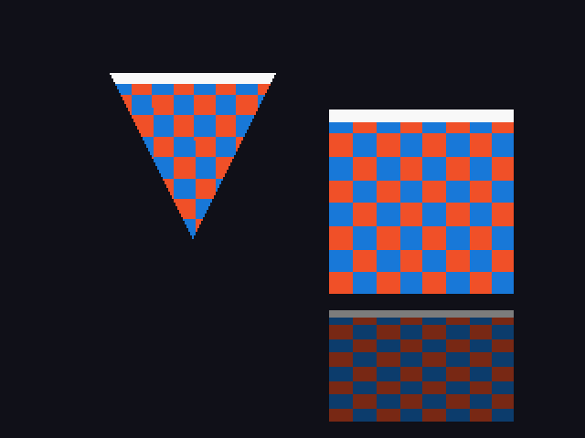

# Port spike — is a modern port of Digimon World realistic?

Three experiments, all passing. Together they cover the things that decide
whether a port is worth starting.

```bash
./port/build.sh           # 1. game logic on x86
./port/build_triangle.sh  # 2. PS1 primitives through SDL2
./port/build_gte.sh       # 3. the geometry coprocessor, measured
```

Only #2 needs SDL2. None need a PlayStation toolchain or a disc image.

---

## 1. Game logic runs unmodified

`src/main/evolution.c` compiles and executes on x86-64 with **zero changes**.

```
EVO_REQ_DATA 63 entries · EVO_PATHS_DATA 62 entries
EvoRequirements = 28 bytes (PS1: 28)

fresh(1)       -> 2
in-training(3) -> 5        <- a real evolution decision
```

The evolution system turned out to have **no real PlayStation dependency**: it
only inherited `libgte.h` through `entity.h` and never called into it.

## 2. PS1 primitives rasterise through SDL2



Built with the **game's own macros** — `setXYWH` / `setUVWH`, exactly what
`src/main/utils.c` calls.

```
POLY_FT4 = 40 bytes   POLY_FT3 = 32 bytes   POLY_F4 = 24 bytes
triangle 4141 px · quad 10201 px · V orientation correct · tinting works
```

Why these: a survey counts **386 `POLY_FT4`** and 6 `POLY_FT3` uses out of ~460
primitives total. This is the representative case, not a toy.

## 3. The GTE — measured, not estimated

An earlier guess of "181 fixed-point uses" was wrong. The measured surface:

```
632 call sites · 29 distinct operations · 34 of 126 files
```

And it is heavily skewed — **eleven operations cover 80%** of all uses:

| op | sites | cumulative |
|---|---|---|
| `ApplyMatrixSV` | 103 | 16% |
| `RotMatrix` | 51 | 24% |
| `RotMatrixZYX` | 44 | 31% |
| `RotMatrixYXZ` | 44 | 38% |
| `ratan2` | 43 | 45% |
| `gte_stsxy` | 42 | 52% |
| `gte_rtps` | 42 | 58% |
| `gte_ldv0` | 42 | 65% |
| `ScaleMatrix` | 39 | 71% |
| `TransMatrix` | 37 | 77% |
| `ApplyMatrixLV` | 23 | **81%** |

Those eleven are implemented in `port/gte.c` and pass their fixed-point
contract: 1.3.12 matrix entries, 4096 units per turn, **saturation rather than
wraparound** (a wrapped value flips a vertex across the screen — exactly the
bug class that is easy to ship and miserable to find).

### The number that actually decides it

"0.17% trig error" says nothing. The useful measurement is screen-space
displacement, over 2528 projected vertices across a full rotation sweep:

```
mean error:             0.825 px
worst error:            1.896 px
vertices off by > 2px:  0.00%
```

**Verdict: sub-2-pixel everywhere.** Good enough that no player would see it;
**not** bit-exact, so it cannot be used to validate a matching decomp. The real
GTE uses lookup tables, and matching hardware exactly requires those tables.

That distinction matters: this is a *port* technique, not a *decomp* technique.

---

## The architecture this forced

The most useful output of the spike is a boundary, not code.

```
gpu_sdl.c / gte.c   plain C types, never see the game's headers
prim_glue.c         THE FENCE — converts between the two worlds
run_*.c             the game's 32-bit MIPS types, never see SDL
```

They must never meet in one translation unit. `dw/types.h` has
`typedef int intptr_t` and its own `int8_t`; SDL drags in `<stdint.h>`.
The first attempt hit that head-on. The fix is not a macro trick — it is
keeping the renderer and the maths ignorant of the game's type universe, which
is the right shape for a port anyway, and the build now enforces it.

## Friction worth recording

1. **32-bit assumptions.** The decomp targets MIPS. Stubs must use the game's
   own types, never `<stdint.h>`.
2. **`random()` collides with glibc.** `dw/math.h` declares `random(int32_t)`.
3. **Zeroed globals produce `-1`, not a crash.** `calculateRequirementScore()`
   reads `PARTNER_PARA` and `DIGIMON_DATA`, loaded from disc in the real game.
   Empty tables fail the weight check, so "no evolution" is *correct*. Mistaking
   that for a bug would cost weeks.
4. **Affine texture mapping is deliberate.** The PS1 had no perspective
   correction; its warping is part of the look.
5. **The GTE saturates.** Modelling that is not optional.

## What's here

```
port/include/       portable stand-ins for libgte / libgpu / libgs / libcd
port/harness.c      the 18 externals evolution.c needs
port/gpu_sdl.c      software rasteriser: textured tris/quads, CLUT, tinting
port/gte.c          software GTE: the 11 operations covering 80% of uses
port/prim_glue.c    the type fence
port/run_*.c        the three experiments
```

`static_assert`s pin every struct size. If a stub drifts from the PS1 layout the
build fails, instead of silently misreading every data table.

## Honest limits

- **One logic file out of 126**, chosen because it was the best case.
- **GTE is approximate, not exact.** 18 of 29 operations are unimplemented
  (the tail 20%), and the trig is polynomial rather than table-driven.
- **No ordering table.** Primitives draw immediately; the PS1 depth-sorts via
  `GsSortObject` / `GsDrawOt`.
- **No semi-transparency, no Gouraud, no indexed CLUT textures.**
- **Nothing validated against the retail binary** — that needs the MIPS
  toolchain and a disc image.
- **Assets remain Bandai's.** A port ships as an engine; each user supplies
  their own disc.
